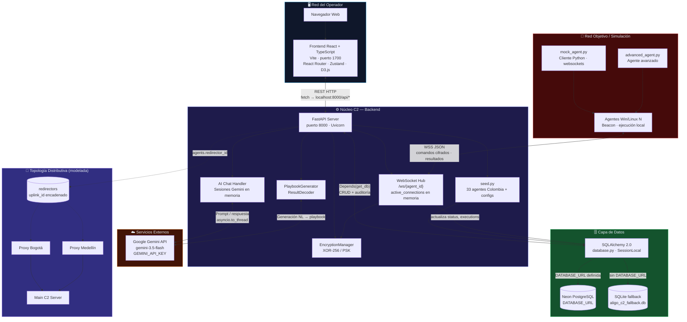
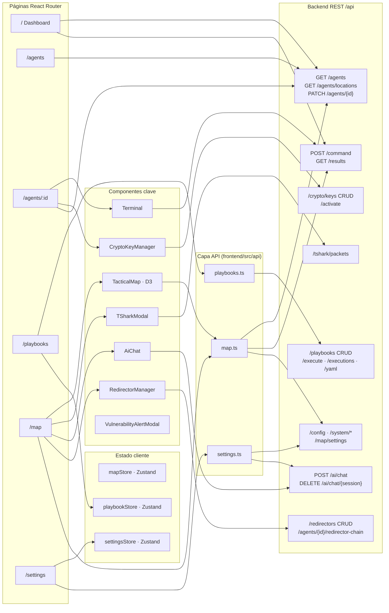
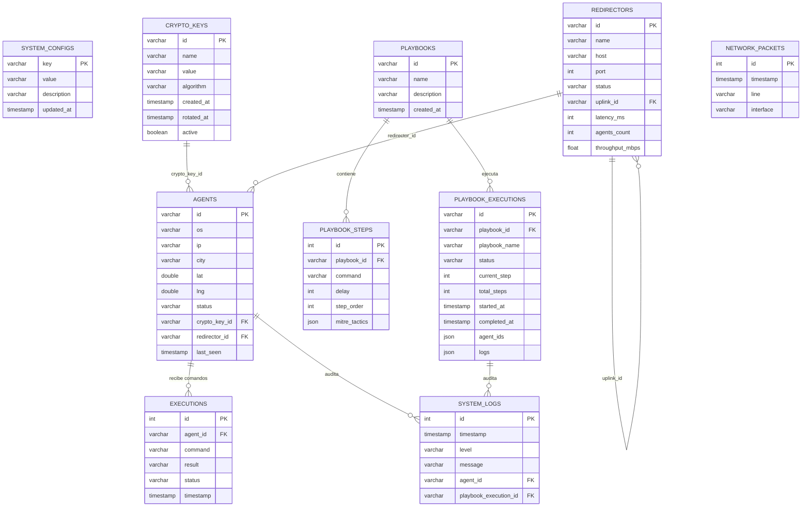
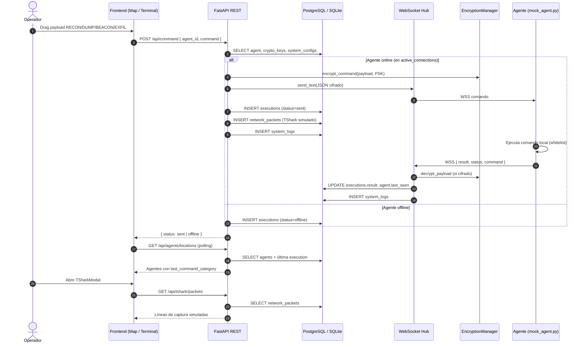
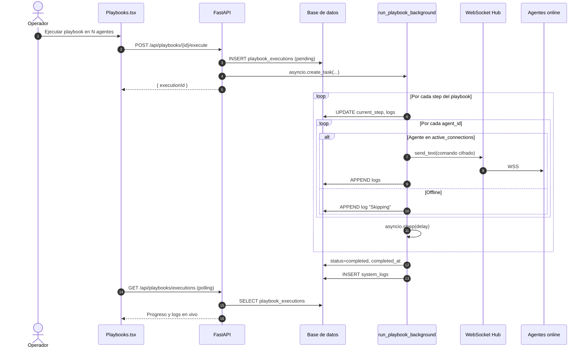
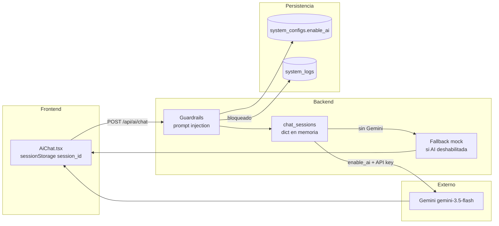
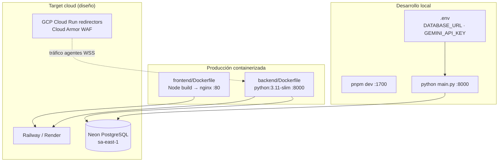

# Aligo C2 — Arquitectura Unificada del Sistema

Documento de referencia con diagramas Mermaid que describen la plataforma completa: operador (frontend), servidor C2 (backend), persistencia, agentes de campo e integraciones externas.

---

## 1. Vista general — Sistema unificado

---

## 2. Frontend — Páginas, componentes y APIs

---

## 3. Modelo de datos relacional (Neon / SQLite)

---

## 4. Flujo de despacho de comando (E2E)

---

## 5. Flujo de Playbook multihost

---

## 6. Asistente IA (Copilot SecOps)

---

## 7. Despliegue (contenedores)

---

## Referencia rápida de puertos y variables

| Componente | Puerto / URL | Variables clave |
|------------|--------------|-----------------|
| Frontend Vite | `1700` | `VITE_API_URL` (opcional) |
| Backend FastAPI | `8000` | `DATABASE_URL`, `GEMINI_API_KEY`, `DEFAULT_PSK` |
| WebSocket agentes | `ws://localhost:8000/ws/{agent_id}` | `AGENT_PSK` en agente |
| Neon PostgreSQL | connection string en `.env` | `DATABASE_URL` |
| Fallback SQLite | `backend/aligo_c2_fallback.db` | auto si no hay `DATABASE_URL` |

---

## Módulos backend auxiliares

| Archivo | Responsabilidad |
|---------|-----------------|
| `database.py` | Engine SQLAlchemy, pool_pre_ping, get_db |
| `models.py` | 10 tablas ORM declarativas |
| `seed.py` | Configs, claves, redirectores, 33 agentes, playbooks demo |
| `encryption_manager.py` | Cifrado XOR de payloads WSS |
| `playbook_generator.py` | Generación/decodificación vía Gemini |
| `redirector_simulator.py` | Modelo lógico de redirectores (legacy/simulación) |
| `c2_client.py` | Cliente C2 de referencia |
